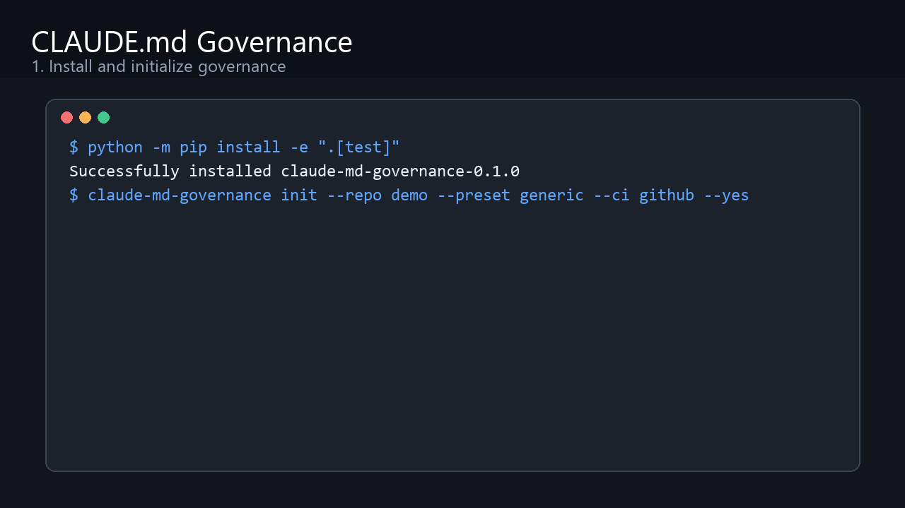

# CLAUDE.md Governance

Keep `CLAUDE.md` short. Make rules enforceable. Stop context drift.

Make Claude Code repo rules enforceable with policy-as-code, hooks, and CI.

[](https://github.com/lliangcol/claude-md-governance/actions/workflows/ci.yml)
[](https://github.com/lliangcol/claude-md-governance/actions/workflows/claude-md-governance.yml)
[](https://github.com/lliangcol/claude-md-governance/releases)
[](pyproject.toml)
[](LICENSE)



## Quickstart

Until a PyPI release is published, the public install path is the GitHub Release
wheel or a source checkout. Do not use a PyPI badge or `pip install
claude-md-governance` until that package is live.

```bash
python -m pip install -e ".[test]"
claude-md-governance init --repo <your-repo> --preset generic --ci github --yes
claude-md-governance verify --repo <your-repo>
```

After `v0.1.0` is published on GitHub Releases, the wheel install path is:

```bash
python -m pip install "https://github.com/lliangcol/claude-md-governance/releases/download/v0.1.0/claude_md_governance-0.1.0-py3-none-any.whl"
claude-md-governance init --repo <your-repo> --preset generic --ci github --yes
claude-md-governance verify --repo <your-repo>
```

Expected success output includes:

```text
Installed CLAUDE.md governance into <repo>
Preset: generic; CI provider: github; ConfigChange mode: block
Governance verification passed.
```

## What It Does

- Installs a short root `CLAUDE.md` with enforceable repo rules.
- Adds versioned policy files under `.claude-governance/`.
- Registers Claude Code `PreToolUse`, `PostToolUse`, and `ConfigChange` hooks.
- Runs deterministic lint and verify checks locally and in CI.
- Creates local module rules for sensitive paths when a preset detects them.

## Why Not Just Write A Bigger `CLAUDE.md`?

| Bigger `CLAUDE.md` | CLAUDE.md Governance |
| --- | --- |
| Rules are only context. | Rules become policy, hooks, and CI checks. |
| Context grows until it is hard to scan. | Root instructions stay short and link to focused local context. |
| Hook drift is easy to miss. | `verify` checks hook registrations and protected-path behavior. |
| Sensitive modules depend on memory. | Presets create local `CLAUDE.md` files for sensitive paths. |
| CI cannot tell whether agent rules still work. | Deterministic lint, mutation, and smoke checks fail the build. |

## Demo

Run the built-in demos from a source checkout:

```bash
bash scripts/demo_generic.sh
bash scripts/demo_enterprise_java_codeup.sh
bash scripts/demo_bad_repo.sh
```

The main demo flow is:

1. Copy a small fixture repo.
2. Run `init` with the `generic` preset.
3. Run `verify` and show governance checks passing.
4. Switch to the bad fixture and show deterministic failure.

More details: [docs/demo.md](docs/demo.md).

## Presets

- `generic`: default policy for ordinary repositories; `ConfigChange` blocks by default.
- `java-maven`: Java/Maven thresholds and sensitive path patterns; `ConfigChange` warns by default.
- `enterprise-java-codeup`: Java/Maven + Codeup example preset with Codeup CI assets.
- `auto`: conservative local detection; public docs and CI should prefer explicit presets.

Codeup example:

```bash
claude-md-governance init --repo <repo> --preset enterprise-java-codeup --ci codeup --config-change-mode warn --yes
claude-md-governance verify --repo <repo>
```

## Verification

Deterministic checks:

```bash
claude-md-governance verify --repo .
claude-md-governance lint --repo . --policy .claude-governance/policy.json --output .claude-governance/score.json
```

Optional Claude CLI behavior tests:

```bash
claude-md-governance behavior-test --repo . --cases tests/ai_behavior_cases.json
claude-md-governance verify --repo . --with-claude
```

If Claude CLI is unavailable or not logged in, optional behavior tests are
reported as `SKIPPED`. Use `--require-claude` only when CI must fail on a missing
Claude session.

## Security Model

- Hooks run repo-local allowlisted commands without shell chaining.
- `PreToolUse` can block protected path edits before writes happen.
- `PostToolUse` can report failures after tool actions, but it cannot undo writes.
- `ConfigChange` can be configured as `block`, `warn`, or `off`.
- The tool does not read secrets, send telemetry, or replace human code review.

See [docs/security-model.md](docs/security-model.md).

## Contributing

Start with [CONTRIBUTING.md](CONTRIBUTING.md) and [GOVERNANCE.md](GOVERNANCE.md).
Good first contributions include new presets, behavior cases, CI provider docs,
demo fixtures, and governance rule requests.

## Docs

- [Getting Started](docs/en/getting-started.md) / [快速开始](docs/getting-started.md)
- [Concepts](docs/en/concepts.md) / [概念](docs/concepts.md)
- [Policy Reference](docs/en/policy-reference.md) / [规则参考](docs/policy-reference.md)
- [Hooks Reference](docs/en/hooks-reference.md) / [Hooks 参考](docs/hooks-reference.md)
- [GitHub CI](docs/en/ci-github.md) / [GitHub CI](docs/ci-github.md)
- [Codeup CI](docs/en/ci-codeup.md) / [Codeup CI](docs/ci-codeup.md)
- [Verification](docs/en/verification.md) / [验证](docs/verification.md)
- [Behavior Tests](docs/en/behavior-tests.md) / [行为测试](docs/behavior-tests.md)
- [Release Checklist](docs/release-checklist.md)
- [Launch Plan](docs/launch-plan.md)
- [Roadmap](ROADMAP.md)

## 中文说明

`claude-md-governance` 是一个 Python CLI，用 policy-as-code 管理 Claude Code
项目的 `CLAUDE.md`、hook、CI 和验证报告。它会生成可审计的规则、保护敏感路径，
并用确定性检查发现 `CLAUDE.md` 过长、规则空泛、hook 缺失或本地模块规则缺失等问题。
